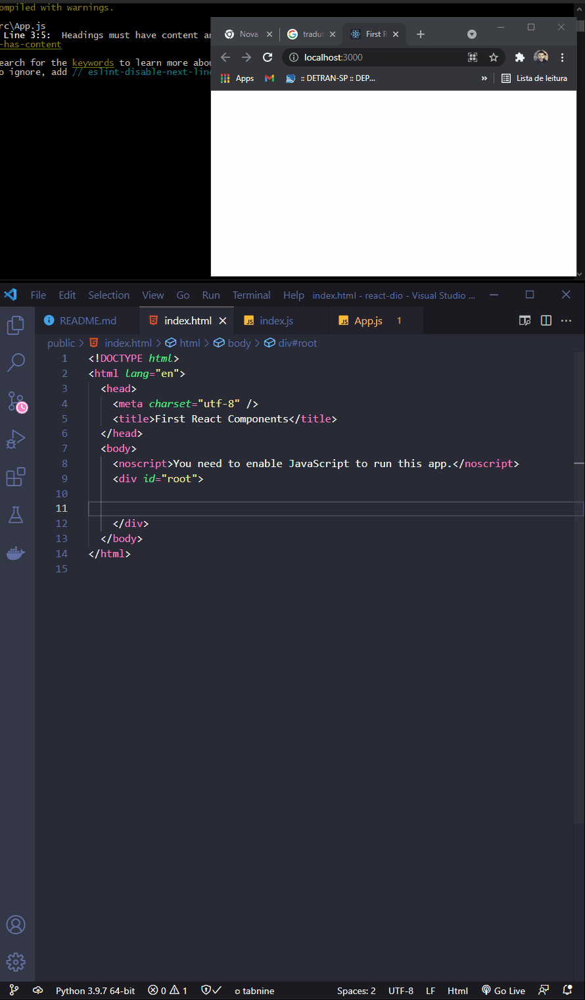
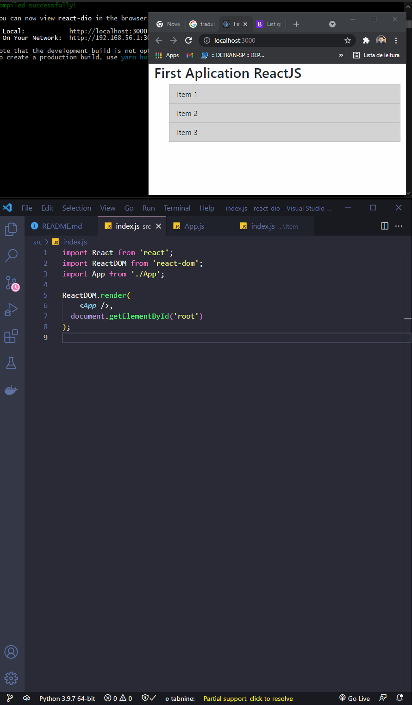
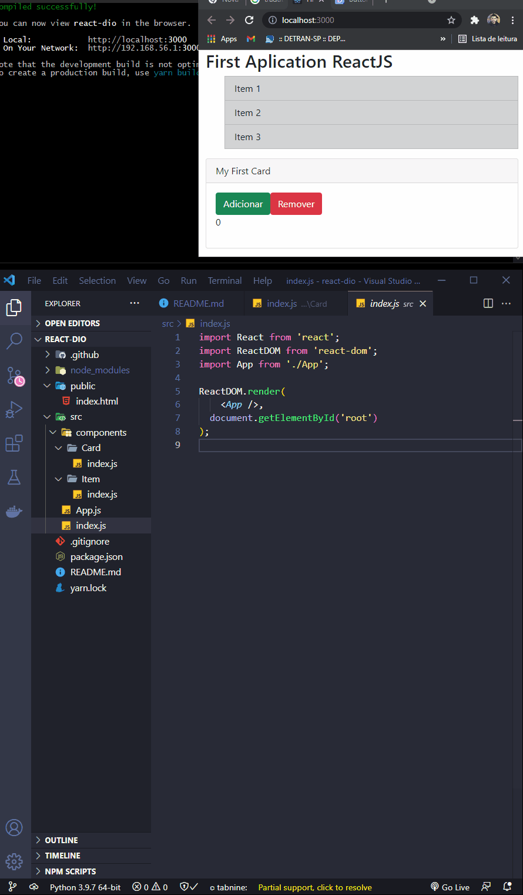
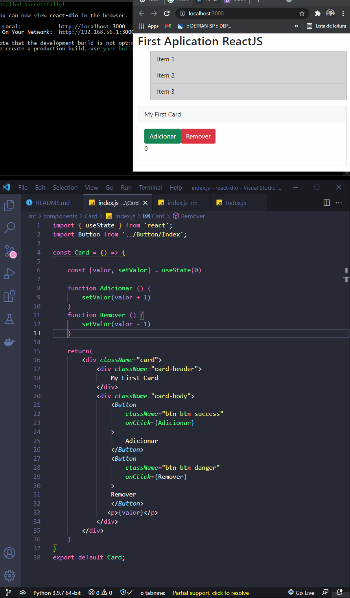
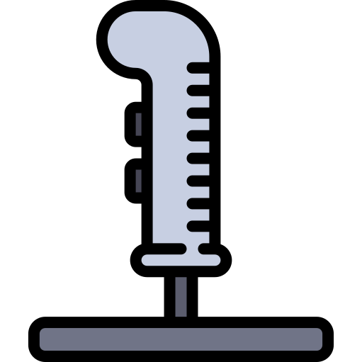

<h1 align="center">
  
   
  ReactJS - Working with Components
</h1>

<h3 align="justify">
Didactic demonstration Configuration Basic, Aplication Basic, Use State e Componentization. Credits for the Digital Innovation One Working with Components, and channel you tube Matheus Catiglioni.
</h3>

 

## 📷 Demonstration

<h4 align="left"> Configuration Basic </h4>
  

<h4 align="left"> Aplication Basic </h4>
  

<h4 align="left"> Use State </h4>
  

<h4 align="left"> Componentization </h4>
  

 

## 🚀 Technologies

This project was developed with the following technologies:

- ReactJS
- JavaScript ES6
- Nodejs
- HTML5
- Bootstrap

 

## ⚙ For Shooting after download
- npm i

## ⚙ Commands
- npx create-react-app react-dio
- npm start

## ⚙ Sources
- https://pt-br.reactjs.org/docs/create-a-new-react-app.html
- https://getbootstrap.com/docs/5.1/getting-started/introduction/
- https://getbootstrap.com/docs/5.1/components/list-group/
- https://getbootstrap.com/docs/5.1/components/card/
- https://getbootstrap.com/docs/5.1/components/buttons/

## ⚙ To Climb Cloud
- npm run build
- https://app.netlify.com/drop

## ⚙ Test

 

---

Made with 💜 by Rafael Maciel
